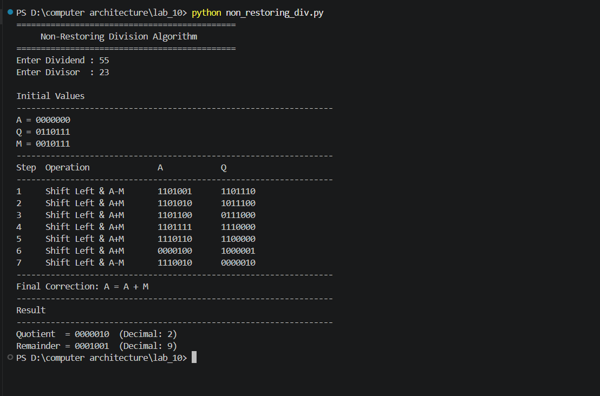

# Lab 10: Program to Implement the Non-Restoring Division Algorithm

## Objective

- To understand the Non-Restoring Division Algorithm for unsigned binary numbers.
- To implement the algorithm in Python.
- To verify the correctness of the algorithm using different test cases.

---

## Theory

The **Non-Restoring Division Algorithm** is an efficient binary division technique used in computer architecture for dividing unsigned binary numbers. Unlike the **Restoring Division Algorithm**, it eliminates the restoration step after a negative subtraction, thereby reducing the number of arithmetic operations and improving execution speed.

The algorithm uses two registers:

- **A** – Partial Remainder (Accumulator)
- **Q** – Dividend/Quotient Register

Initially, the accumulator **A** is set to zero, and the dividend is loaded into **Q**. During each iteration, the combined register **[A, Q]** is shifted left by one bit. Depending on the sign of **A**, either subtraction or addition of the divisor is performed. After all iterations, if the accumulator contains a negative value, one final correction is performed by adding the divisor.

This algorithm is commonly implemented in processors because it avoids unnecessary restoration operations while producing the correct quotient and remainder.

---

## Algorithm

Given:

- **Q** = Dividend (n-bit unsigned binary number)
- **M** = Divisor (n-bit unsigned binary number)

1. Initialize:
   - Set **A = 0**.
   - Load the dividend into **Q**.

2. Repeat the following steps **n** times:

   a. Perform a **left shift** on the combined register **[A, Q]**.

   b. Perform the arithmetic operation based on the sign of **A**:
   - If **A ≥ 0**, subtract the divisor:
     ```
     A = A − M
     ```
   - If **A < 0**, add the divisor:
     ```
     A = A + M
     ```

   c. Set the least significant bit of **Q**:
   - If **A ≥ 0**, set **Q₀ = 1**.
   - If **A < 0**, set **Q₀ = 0**.

3. After completing all iterations, check **A**:
   - If **A < 0**, perform the final correction:
     ```
     A = A + M
     ```

4. The final contents are:
   - **Q** → Quotient
   - **A** → Remainder

---

## Features

- Implements the Non-Restoring Division Algorithm for unsigned binary numbers.
- Accepts dividend and divisor as user input.
- Displays each step of the algorithm in a formatted table.
- Performs automatic final correction when required.
- Displays the quotient and remainder in both binary and decimal forms.
- Includes input validation to prevent division by zero.

---

## Program

The complete Python implementation is available in:

```text
non_restoring_div.py
```

---


## Sample Output


---

## Conclusion

The Non-Restoring Division Algorithm provides an efficient approach for performing binary division by eliminating the restoration step used in the restoring division method. Instead of restoring the partial remainder immediately after a negative subtraction, the algorithm delays the correction until the end of the process. This reduces the number of arithmetic operations while producing the correct quotient and remainder. The Python implementation successfully demonstrates each iteration of the algorithm, making it useful for understanding binary division in computer architecture.

---
