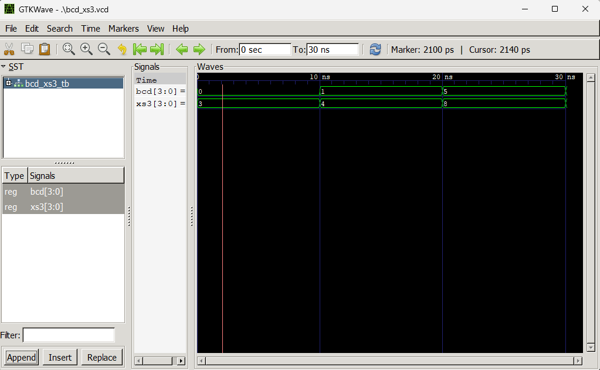
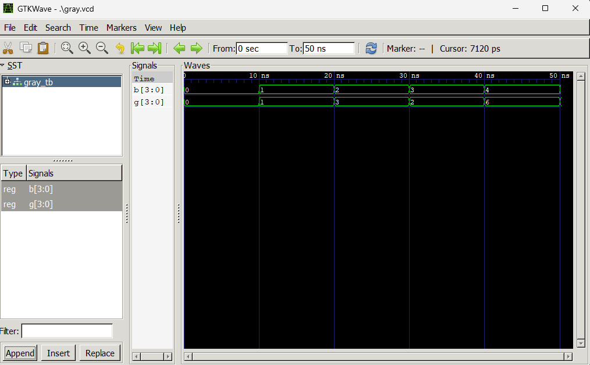

# Lab 6: VHDL Code for Combinational Circuits — Code Converter

---

## Objective

- To design and simulate a BCD-to-Excess-3 code converter in VHDL.
- To design and simulate a Binary-to-Gray code converter in VHDL.

---

## Theory

### BCD to Excess-3 (XS-3)

Excess-3 is a non-weighted BCD code obtained by adding 3 (0011) to each BCD digit. It is self-complementing, meaning the 9's complement of any digit can be obtained by simply inverting all bits. This property makes it useful in arithmetic circuits.

| Decimal | BCD (DCBA) | Excess-3 (WXYZ) |
|---------|------------|-----------------|
| 0       | 0000       | 0011            |
| 1       | 0001       | 0100            |
| 2       | 0010       | 0101            |
| 3       | 0011       | 0110            |
| 4       | 0100       | 0111            |
| 5       | 0101       | 1000            |
| 6       | 0110       | 1001            |
| 7       | 0111       | 1010            |
| 8       | 1000       | 1011            |
| 9       | 1001       | 1100            |

In VHDL, this conversion is implemented using the `NUMERIC_STD` library by casting the BCD input to `unsigned`, adding 3, and casting back to `std_logic_vector`.

---

### Binary to Gray Code

Gray code is a binary numeral system where two successive values differ by only **one bit**. This property minimizes errors during transitions and makes it widely used in rotary encoders and digital communication systems.

The conversion rule from Binary (B) to Gray (G) is:

```
G(MSB) = B(MSB)
G(i)   = B(i+1) XOR B(i)
```

In VHDL, this is implemented using the **Dataflow** modeling style with concurrent XOR signal assignments.

### Expected Output — Binary to Gray

| Binary (B) | Gray (G) |
|------------|----------|
| 0000       | 0000     |
| 0001       | 0001     |
| 0010       | 0011     |
| 0011       | 0010     |
| 0100       | 0110     |
| 1111       | 1000     |

---

## Output

### BCD to Excess-3



**Observation:** For each BCD input, the XS3 output was exactly 3 (0011) more than the input, matching the expected conversion table for all four test cases.

---

### Binary to Gray



**Observation:** For each binary input, the Gray code output matched the expected value. Consecutive Gray code values differed by exactly one bit, confirming correct conversion behavior.

---

## Discussion and Conclusion

This lab demonstrated the design and simulation of two combinational code converters in VHDL. The BCD-to-Excess-3 converter was implemented using the Behavioral modeling style, leveraging the `NUMERIC_STD` library to perform unsigned addition directly on `std_logic_vector` inputs. The Binary-to-Gray converter was implemented using the Dataflow style through concurrent XOR signal assignments, reflecting the direct hardware nature of the conversion. Both designs were verified through dedicated testbenches and GTKWave waveforms confirmed correct outputs for all input combinations. This lab reinforced the use of both Behavioral and Dataflow modeling styles and highlighted how different code conversion techniques are efficiently realized in hardware description languages.
