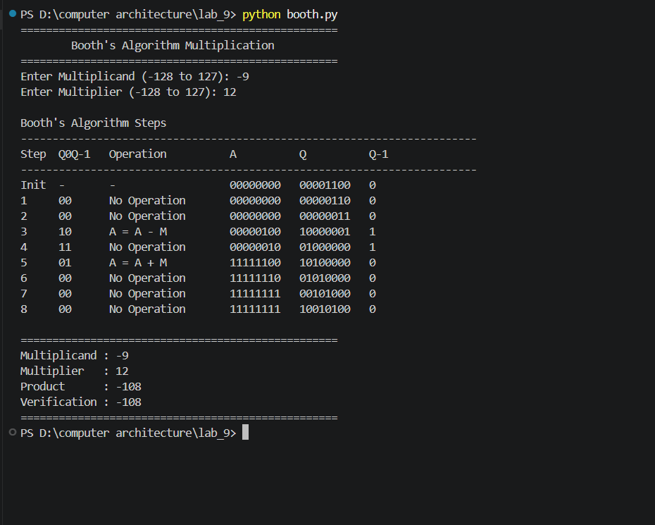

# Lab 9: Program to Implement the Booth Algorithm

## Objective

- To understand the Booth multiplication algorithm for signed binary numbers.
- To implement the Booth algorithm in Python.
- To verify the correctness of the algorithm using different test cases.

---

## Theory

The **Booth Algorithm**, proposed by **Andrew D. Booth in 1951**, is an efficient algorithm for multiplying two signed binary numbers represented in **two's complement** form. It minimizes the number of addition and subtraction operations by identifying consecutive sequences of `1`s in the multiplier.

Unlike the conventional binary multiplication method, Booth's algorithm examines the least significant bit (**Q₀**) of the multiplier along with an additional bit (**Q₋₁**) to determine whether to add, subtract, or perform no arithmetic operation before shifting.

This method is widely used in computer architecture because it efficiently handles both positive and negative numbers.

---

## Algorithm

Given:
- **M** = Multiplicand (n-bit binary number)
- **Q** = Multiplier (n-bit binary number)

1. Initialize:
   - Accumulator **A = 0**
   - Extra bit **Q₋₁ = 0**
   - Step count = **n**

2. Examine the pair **(Q₀, Q₋₁)** and perform the corresponding operation:

| Q₀ | Q₋₁ | Operation |
|:--:|:---:|-----------|
| 0 | 0 | No operation (Shift only) |
| 0 | 1 | A = A + M |
| 1 | 0 | A = A − M |
| 1 | 1 | No operation (Shift only) |

3. Perform an **Arithmetic Right Shift** on the combined register **[A, Q, Q₋₁]**.

4. Repeat Steps **2** and **3** exactly **n** times.

5. The final product is stored in the combined register **[A, Q]**.

---

## Features

- Supports signed binary multiplication using two's complement representation.
- Accepts user input for multiplicand and multiplier.
- Displays the complete step-by-step execution of Booth's Algorithm.
- Shows the values of **A**, **Q**, and **Q₋₁** after every iteration.
- Verifies the computed result using Python's built-in multiplication operator.

---

## Program

The complete Python implementation is available in:

## Sample Output

## Conclusion

The Booth Algorithm provides an efficient method for multiplying signed binary numbers in two's complement form. By reducing unnecessary addition and subtraction operations, it improves multiplication efficiency, particularly when the multiplier contains consecutive sequences of `1`s. The implementation successfully computes the product while displaying each intermediate step, making it suitable for understanding the internal working of the algorithm.

---

## Author

**Name:** *Your Name*  
**Course:** Computer Engineering  
**Lab:** Computer Architecture Laboratory
